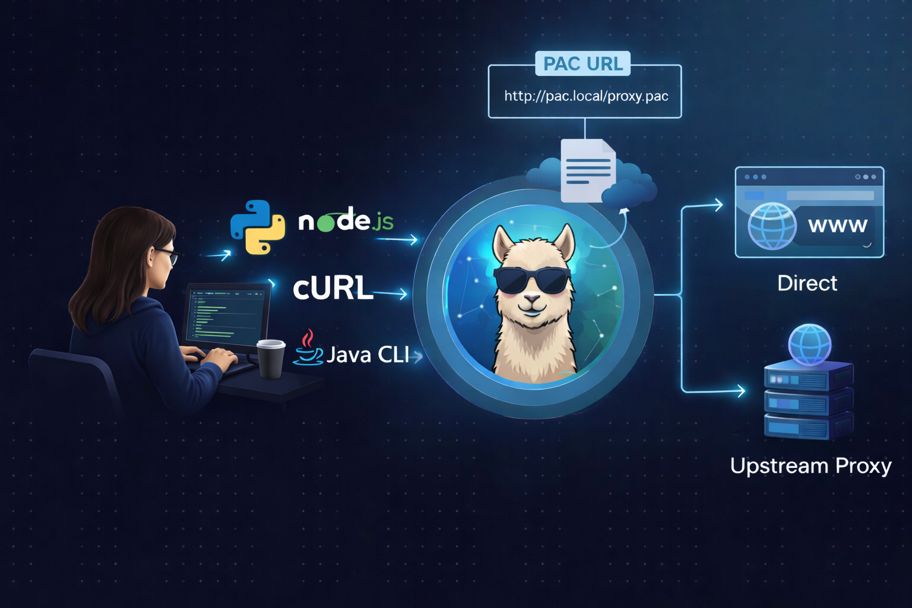

# Alpaca


![Latest Tag][2] ![GitHub Workflow Status][3] ![GitHub Releases][4]

Alpaca is a local HTTP proxy for command-line tools. It supports proxy
auto-configuration (PAC) files, NTLM authentication, HTTP Basic
authentication, and (on macOS) Kerberos/Negotiate (SPNEGO) authentication.


## Install using Homebrew

If you're using macOS and use [Homebrew](https://brew.sh/), you can install
using:

```sh
$ brew tap samuong/alpaca
$ brew install samuong/alpaca/alpaca
```

Launch Alpaca by running `alpaca`, or by using `brew services start alpaca`.

## Install using Go

If you've got the [Go](https://golang.org/cmd/go/) tool installed, you can
install using:

```sh
$ go install github.com/samuong/alpaca/v2@latest
```

## Build from source

If you'd like to build Alpaca from source, you'll need [Go](https://go.dev/)
1.22.3 or later. CGO must be enabled:

```sh
$ CGO_ENABLED=1 go build -v .
```

To run the tests:

```sh
$ CGO_ENABLED=1 go test ./...
```

## Download Binary

Alpaca can be downloaded from the [GitHub releases page][1].

## Install from distribution packages

[](https://repology.org/project/alpaca-proxy/versions)

## Usage

Start Alpaca by running the `alpaca` binary.

If the proxy server requires valid authentication credentials, you can provide them by means of:

- HTTP Basic authentication, if `BASIC_CREDENTIALS=login:password` is set in
  the environment;
- Kerberos / Negotiate, **automatically on macOS** when a ticket from Apple
  SSO / Ticket Viewer / `kinit` is available — no flag required (pass `-w
  SECONDS` to wait for one at startup, or `--no-kerberos` to opt out);
- NTLM via the shell prompt, if `-d` is passed;
- NTLM via the shell environment, if `NTLM_CREDENTIALS` is set;
- the system keyring (macOS, Windows and Linux/GNOME supported), if none of
  the above applies.

Multiple authentication methods can be enabled simultaneously. When the proxy
returns `407 Proxy Authentication Required`, Alpaca parses the proxy's
`Proxy-Authenticate` response header(s) and tries each configured method whose
scheme appears in the advertisement, in Chrome's preference order
(Negotiate → NTLM → Basic). If the proxy returns 407 with no parseable
`Proxy-Authenticate` header, Alpaca will only try schemes that begin with a
non-credential probe (NTLM Type 1, SPNEGO initial token); Basic credentials
are NEVER sent without an explicit advertisement, so a hostile endpoint
returning a bare 407 cannot harvest your password.

Otherwise, the authentication with proxy will be simply ignored.

### Security note for Kerberos users

When Negotiate is active (auto-detected on macOS, or via `-w`), Alpaca
requests a Kerberos service ticket for the upstream proxy host returned by
your PAC file. If the PAC file is delivered over plain HTTP from an
untrusted network, an attacker could redirect Alpaca to request tickets
for an attacker-named SPN.

To restrict which proxy hosts Alpaca will request SPNEGO tokens for, set
`KERBEROS_SPN_ALLOWLIST` to a comma-separated list of DNS suffixes:

```sh
$ export KERBEROS_SPN_ALLOWLIST=.corp.example.com,.example.test
```

A leading-dot entry (`.corp.example.com`) matches `corp.example.com` itself
and any subdomain of it. A bare entry (`corp.example.com`) is normalised to
the same form. The literal value `*` means "any proxy host".

**Default behaviour on macOS:** if `KERBEROS_SPN_ALLOWLIST` is unset and a
Kerberos ticket is present, Alpaca derives a default allowlist from the
realm of the user's default credential (e.g. `alice@CORP.EXAMPLE.COM`
yields `.corp.example.com`). This restricts SPN requests to your home
realm — the security boundary that actually matters for SPN coercion. To
permit cross-realm SPN requests, set `KERBEROS_SPN_ALLOWLIST=*` explicitly.
A stderr message at startup tells you what default was picked, or warns if
the realm could not be determined.

### Platform support for Kerberos

Kerberos / Negotiate authentication in this build is **macOS only**. It uses
Apple's `GSS.framework` to consume the system Kerberos credential cache —
the same one populated by Apple SSO, Ticket Viewer, and `kinit` — so no
extra configuration is required when a ticket is already present.

Windows and Linux Kerberos handling is intentionally out of scope for this
change; on those platforms `newNegotiateAuthenticator` returns `nil` and
Negotiate is transparently absent from the auth chain. Adding support on
either platform is a follow-up:

- **Windows** has system-wide Kerberos via SSPI (`Negotiate` package) and
  could be implemented either via cgo against `security.h` or in pure Go
  via `github.com/alexbrainman/sspi`.
- **Linux** has no system-wide credential store but `github.com/jcmturner/gokrb5`
  can read the per-user `krb5cc_$UID` cache produced by `kinit`.

Both are clean drop-in additions next to `kerberos_darwin.go`, sharing
the same `proxyAuthenticator` interface.

### Shell Prompt

You can also supply your domain and username (via command-line flags) and a
password (via a prompt):

```sh
$ alpaca -d MYDOMAIN -u me
Password (for MYDOMAIN\me):
```

### Non-interactive launch

If you want to use Alpaca without any interactive password prompt, you can store
your NTLM credentials (domain, username and MD4-hashed password) in an
environment variable called `$NTLM_CREDENTIALS`. You can use the `-H` flag to
generate this value:

```sh
$ ./alpaca -d MYDOMAIN -u me -H
# Add this to your ~/.profile (or equivalent) and restart your shell
NTLM_CREDENTIALS="me@MYDOMAIN:823893adfad2cda6e1a414f3ebdf58f7"; export NTLM_CREDENTIALS
```

Note that this hash is *not* cryptographically secure; it's just meant to stop
people from being able to read your password with a quick glance.

Once you've set this environment variable, you can start Alpaca by running
`./alpaca`.

### Keyring

On macOS, if you use [NoMAD](https://nomad.menu/products/#nomad) and have configured it
to [use the keychain](https://nomad.menu/help/keychain-usage/), Alpaca will use
these credentials to authenticate to any NTLM challenge from your proxies.

On Windows and Linux/GNOME you will need some extra work to persist the username (`NTLM_USERNAME`) and the domain (`NTLM_DOMAIN`) 
in the shell environoment, while the password in the system keyring. Alpaca will read the password from the system keyring 
(in the `login` collection) using the attributes `service=alpaca` and `username=$NTLM_USERNAME`.

To store the password in the GNOME keyring, do the following:
```bash
$ export NTLM_USERNAME=<your-username-here>
$ export NTLM_DOMAIN=<your-domain-here>
$ sudo apt install libsecret-tools
$ secret-tool store -c login -l "NTLM credentials" "service" "alpaca" "username" $NTLM_USERNAME
Password:
# Type your password, then run
$ alpaca
```

On macOS and Linux/GNOME systems, Alpaca uses the PAC URL from your system settings.
If you'd like to override this, or if Alpaca fails to detect your settings, you
can set this manually using the `-C` flag.

### Command-line flags

| Flag | Default | Description |
|------|---------|-------------|
| `-l` | `localhost` | Address to listen on (can be specified multiple times) |
| `-p` | `3128` | Port number to listen on |
| `-C` | (none) | URL of proxy auto-config (PAC) file |
| `-d` | (none) | Domain of the proxy account (for NTLM auth) |
| `-u` | current user | Username for proxy auth (NTLM) |
| `-H` | `false` | Print hashed NTLM credentials and exit |
| `-w` | `0` | Seconds to wait at startup for a Kerberos ticket (macOS only). Default `0` means "don't wait — only use a ticket if one is already present" |
| `--no-kerberos` | `false` | Disable Kerberos / Negotiate auto-detection (macOS only) |
| `-k` | `false` | **Deprecated.** Equivalent to `-w 30`. Negotiate is auto-detected without `-k` whenever a Kerberos ticket is present |
| `-q` | `false` | Quiet mode, suppress all log output |
| `-version` | `false` | Print version and exit |

### Environment variables

| Variable | Description |
|----------|-------------|
| `NTLM_CREDENTIALS`        | `username@DOMAIN:hash` (run `alpaca -H` to generate) |
| `BASIC_CREDENTIALS`       | `login:password` for HTTP Basic proxy auth |
| `KERBEROS_SPN_ALLOWLIST`  | Comma-separated list of DNS suffixes that Alpaca may request Kerberos service tickets for. On macOS, defaults to the user's home Kerberos realm when unset; set to `*` to permit any host explicitly. |
| `NTLM_USERNAME` / `NTLM_DOMAIN` | Used by the keyring credential source (Linux/GNOME, Windows) |

---

### Proxy

You also need to configure your tools to send requests via Alpaca. Usually this
will require setting the `http_proxy` and `https_proxy` environment variables:

```sh
$ export http_proxy=http://localhost:3128
$ export https_proxy=http://localhost:3128
$ curl -s https://raw.githubusercontent.com/samuong/alpaca/master/README.md
# Alpaca
...
```

When moving from, say, a corporate network to a public WiFi network (or
vice-versa), the proxies listed in the PAC script might become unreachable.
When this happens, Alpaca will temporarily bypass the parent proxy and send
requests directly, so there's no need to manually unset/re-set `http_proxy` and
`https_proxy` as you move between networks.

[1]: https://github.com/samuong/alpaca/releases
[2]: https://img.shields.io/github/v/tag/samuong/alpaca.svg?logo=github&label=latest
[3]: https://img.shields.io/github/actions/workflow/status/samuong/alpaca/ci.yml?branch=master
[4]: https://img.shields.io/github/downloads/samuong/alpaca/latest/total
