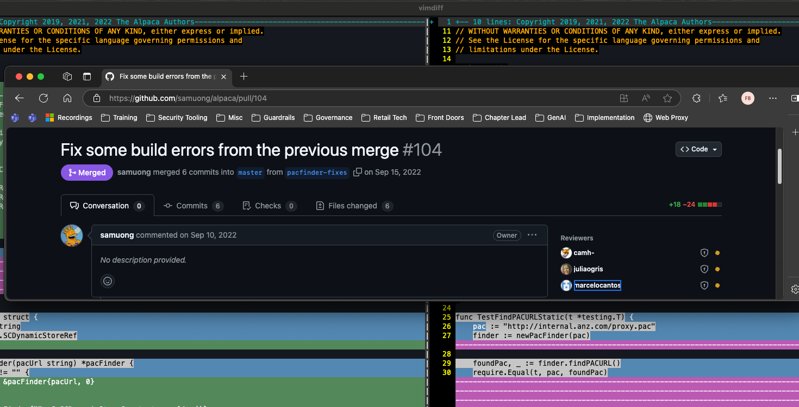

# Analysis of pacfinder_darwin_test.go Issues

This document details why the `pacfinder_darwin_test.go` implementation was a poor tactical fix for the PAC finder functionality.

## Overview of the Test File

The test file `pacfinder_darwin_test.go` contains two test functions:

1. `TestFindPACURLStatic` - Tests the static PAC URL functionality
2. `TestScutilPACUrlTakesPrecedence` - Tests that the PAC URL from `scutil --proxy` takes precedence

## Major Issues with the Test Implementation

### 1. Organization-Specific Hardcoding



The test hardcodes a specific organization's URL:
```go
pac := "http://internal.anz.com/proxy.pac"
```

This creates several problems:

- **Non-portability**: The test is tightly coupled to ANZ's specific infrastructure
- **Security concerns**: Potentially exposing internal URLs in open-source code
- **Maintenance burden**: Requires updates if the organization's internal URLs change
- **Lack of generality**: Makes the test less useful for other users of the library

### 2. Reliance on Bash Instead of Native Go/C

The test references a function `getPACUrlFromScutil()` (not shown in the file) that likely uses the `scutil --proxy` command-line tool instead of using the native C bindings that the rest of the code uses.

```go
// Get the expected PAC URL from scutil
scutilUrl, err := finder.getPACUrlFromScutil()
```

This approach is problematic for several reasons:

- **Inconsistent approach**: The main code uses C bindings, but the test uses shell commands
- **External dependency**: Introduces an unnecessary dependency on an external command
- **Reliability issues**: Shell command execution and output parsing are more error-prone than native code
- **Performance overhead**: Spawning a shell process is significantly slower than using native bindings
- **Platform limitations**: May not work in all environments where the main code would work

### 3. Test Assumptions and Reliability

The test includes comments that reveal its fragility:

```go
// Note: This test assumes that scutil --proxy returns a PAC URL
// If it doesn't, the test will still pass but won't test the precedence logic
```

This indicates serious issues with the test design:

- **False positives**: The test may pass without actually testing what it claims to test
- **Environment dependency**: Test results depend on the specific environment configuration
- **Lack of isolation**: Proper tests should be isolated from the environment and use mocks or fixtures
- **Unreliable verification**: Cannot guarantee consistent behavior across different systems

### 4. Incomplete Testing

The test coverage is severely limited:

- **No error condition testing**: Doesn't verify how the code handles error scenarios
- **No testing of both detection methods**: Doesn't verify both PAC URL detection methods
- **No edge case coverage**: Doesn't test boundary conditions or unusual inputs
- **No negative testing**: Doesn't verify behavior when PAC is disabled or misconfigured

### 5. Visual Evidence from Terminal Output

The terminal output in the PR fix image shows:

```
> scutil --proxy
<dictionary> {
  BypassAllowed : 0
  ExceptionsList : <array> {
    0 : *.local
    1 : *.[redacted]
    2 : *.[redacted]
    3 : 16[redacted]
    4 : au[redacted].au
    5 : d3[redacted].net
    6 : cb[redacted].com
    7 : cb[redacted].com
  }
  FallBackAllowed : 1
  ProxyAutoConfigEnable : 1
  ProxyAutoConfigURLString : http://pac.[redacted].pac
  ProxyCaptiveLoginAllowed : TRUE
}
```

This shows that the test is relying on the output of `scutil --proxy` rather than using the native C bindings to access the same information, which is what the main code should be doing.

## Better Alternatives

A better test implementation would have:

### 1. Used Mock Objects

Instead of relying on the actual system configuration, the test should use mock objects to simulate different system states:

```go
// Example of a better approach with mocking
func TestPACUrlDetection(t *testing.T) {
    // Create a mock SCDynamicStore
    mockStore := newMockSCDynamicStore()
    mockStore.SetProxyAutoConfigEnabled(true)
    mockStore.SetProxyAutoConfigURL("http://example.com/proxy.pac")
    
    finder := newPacFinderWithStore(mockStore)
    url, err := finder.findPACURL()
    
    require.NoError(t, err)
    require.Equal(t, "http://example.com/proxy.pac", url)
}
```

### 2. Tested Multiple Scenarios

A comprehensive test suite would cover various scenarios:

- PAC enabled with valid URL
- PAC enabled but URL missing
- PAC disabled
- Error conditions in SCDynamicStore operations
- Both detection methods (SCDynamicStoreCopyValue and SCDynamicStoreCopyProxies)

### 3. Avoided External Dependencies

Tests should avoid executing external commands like `scutil` and instead use the same APIs as the production code:

```go
// Instead of executing scutil, use the same C bindings
func TestPACUrlDetectionWithCBindings(t *testing.T) {
    // Use the same C bindings as the production code
    // This ensures consistency and reliability
}
```

### 4. Used Parameterized Tests

Parameterized tests would allow testing multiple scenarios with the same test logic:

```go
func TestPACUrlDetectionScenarios(t *testing.T) {
    scenarios := []struct {
        name           string
        pacEnabled     bool
        pacUrl         string
        expectedResult string
        expectError    bool
    }{
        {"PAC enabled with URL", true, "http://example.com/proxy.pac", "http://example.com/proxy.pac", false},
        {"PAC disabled", false, "http://example.com/proxy.pac", "", false},
        {"PAC enabled without URL", true, "", "", false},
        // Add more scenarios
    }
    
    for _, scenario := range scenarios {
        t.Run(scenario.name, func(t *testing.T) {
            // Test implementation using scenario parameters
        })
    }
}
```

## Conclusion

The `pacfinder_darwin_test.go` implementation represents a poor tactical fix because:

1. It hardcodes organization-specific information (ANZ's internal URL)
2. It relies on bash commands (`scutil --proxy`) instead of using native Go/C code
3. It makes unreliable assumptions about the test environment
4. It provides incomplete test coverage of the functionality

These issues make the test:
- Less reliable
- Less maintainable
- Less portable
- Less comprehensive

A proper test implementation would use mocking, cover multiple scenarios, avoid external dependencies, and provide comprehensive coverage of the functionality being tested.
